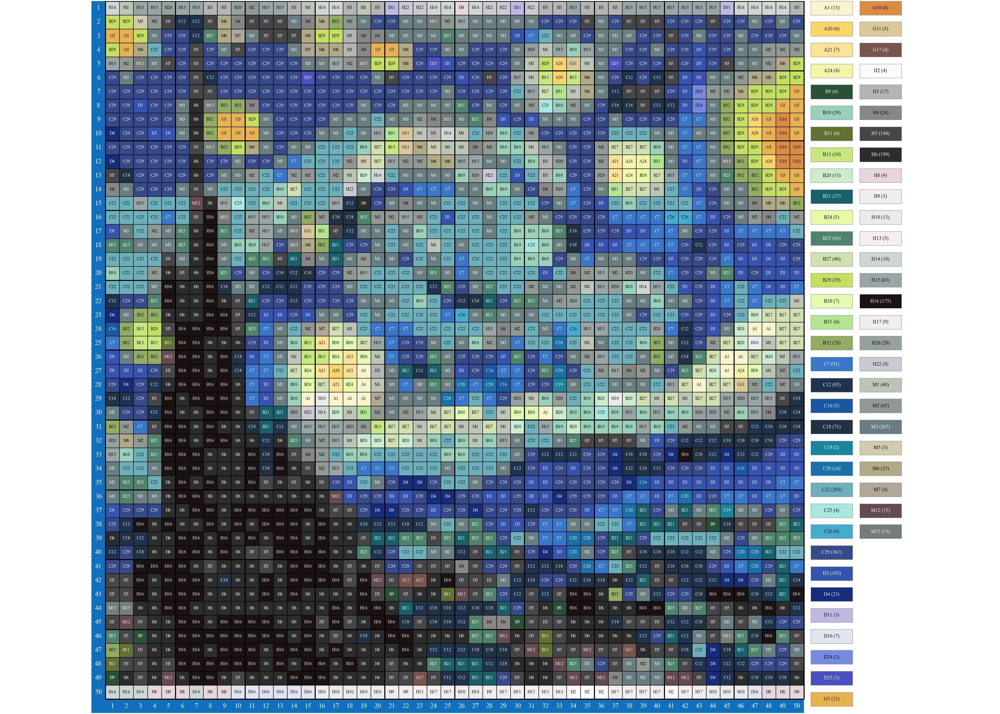

# 拼豆图纸生成器

将任意图片一键转换为拼豆图纸，内置 **Mard 221 色标准色卡**，自动限制颜色数量，输出带色号和网格的像素对照图，非常适合手工拼豆制作参考。

## 效果预览



## 功能亮点

- 🖼️ 支持任意尺寸的 JPG/PNG 图片，自动居中裁剪为正方形
- 🎨 内置 Mard 拼豆官方 221 色卡，颜色还原度高
- 🧩 可自定义像素尺寸（默认 50×50）和最大使用颜色数
- 📊 输出高清图纸，包含：
  - 带网格和坐标的像素图
  - 每个像素块上标注的色号
  - 右侧图例：色号、颜色块和所需豆子数量
- ⚙️ 纯 Python 实现，无需额外软件

## 技术栈

`Python 3` · `NumPy` · `Matplotlib` · `Pillow`

## 快速开始

### 1. 安装依赖

在终端中运行：

```bash
pip install numpy matplotlib Pillow
